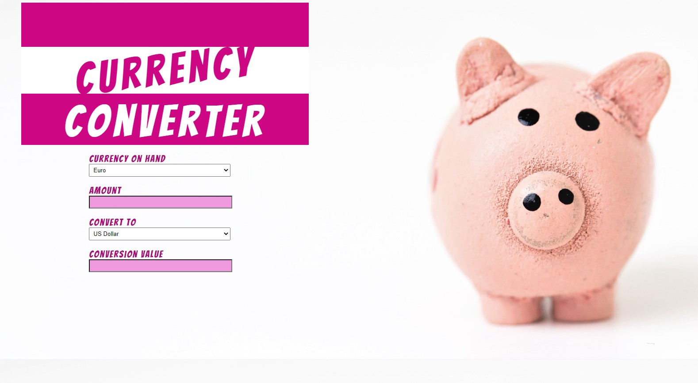
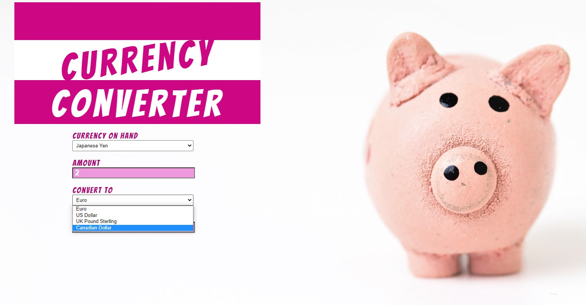
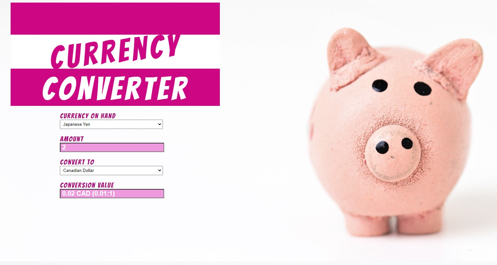

# Currency Converter

## About the project
This application convert the amount of currency to another currency selected by the User.

## What have I learnt from this project
- JavaScript event listener, in this case the onChange function
- How to code solution by functional programming paradigm

## Screenshots

